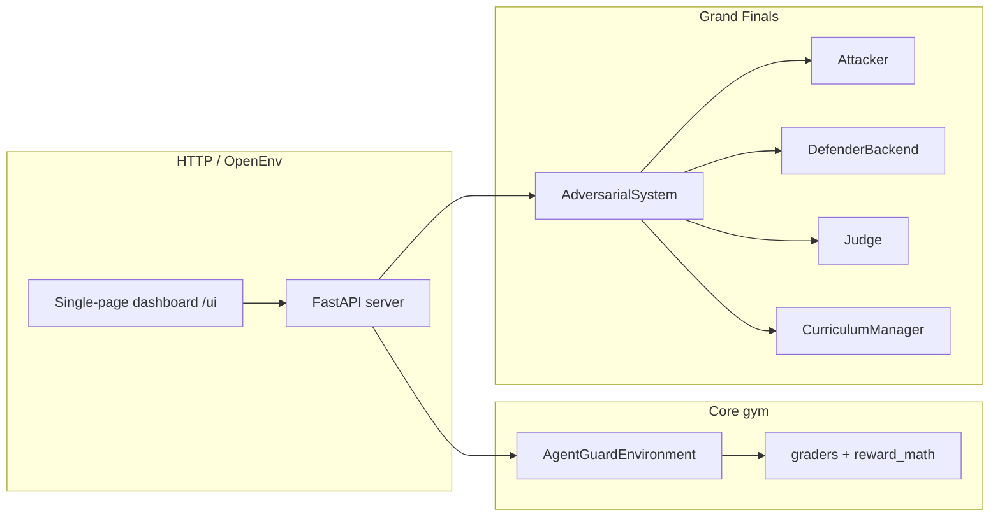

---

## title: AgentGuard-Gym
emoji: "🛡️"
colorFrom: blue
colorTo: red
sdk: docker
pinned: false
license: bsd-3-clause
app_port: 7860
tags:
  - openenv
  - security
  - adversarial-rl

# AgentGuard-Gym

**AgentGuard-Gym** is an [OpenEnv](https://github.com/openenv/)-style cybersecurity gym for **agentic AI defense**: triage of prompt streams, tool/URL traces, and memory artifacts aligned with **OWASP Agentic AI (2026)**-style risk classes. The same codebase provides (1) a **deterministic, grader-based environment** for hackathon baselines, (2) a **Grand Finals adversarial stack** (attacker → defender → judge, curriculum, ELO, novelty, GRPO), including **~30% benign (TN/FP) episodes** from `data/benign_corpus.json` so the defender does not collapse to “always block”, and (3) a **FastAPI server** with a **real-time HTML dashboard** (Server-Sent Events) for episodes and training telemetry.

## Submission links (required by judges)

- **Hugging Face Space (environment URL)**: `https://huggingface.co/spaces/shekhar1090/agentguard-gym-final`
- **Colab notebook (training re-run)**: `COLAB_T4_GUIDE.md` (runbook) — `https://huggingface.co/spaces/shekhar1090/agentguard-gym-final/blob/main/COLAB_T4_GUIDE.md`
- **HF blog writeup (MD file in this Space)**: `HF_BLOG.md` — `https://huggingface.co/spaces/shekhar1090/agentguard-gym-final/blob/main/HF_BLOG.md`
- **YouTube demo (optional, <2 min)**: **TODO** (add link if you record)

> **Scope:** This repository is **AgentGuard-Gym only** (cyber/AI security). Training and math are documented for reproducibility; see `CALCULATIONS_REFERENCE.md` for **AgentGuard** reward derivations (ignore legacy AML-DefenseGym sections in that file if you maintain a single-gym tree).

## Table of contents

1. [Approaches & research map](#1-approaches--research-map)
2. [Architecture (high level)](#2-architecture-high-level)
3. [Component reference](#3-component-reference)
4. [Gaps & blueprint coverage (G1–G16)](#4-gaps--blueprint-coverage-g1g16)
5. [Data, contracts, and files](#5-data-contracts-and-files)
6. [API & real-time UI](#6-api--real-time-ui)
7. [Run locally](#7-run-locally)
8. [Training (GRPO / T4 / Colab / HF)](#8-training-grpo--t4--colab--hf)
9. [Deployment (Docker, Hugging Face Spaces)](#9-deployment-docker-hugging-face-spaces)
10. [Validation, tests, and pre-submission](#10-validation-tests-and-pre-submission)
11. [Environment variables](#11-environment-variables)
12. [Documentation index](#12-documentation-index)

---

## 1. Approaches & research map


| Approach                                    | What we do                                                                                                                                                                      | Where it lives                                                                       |
| ------------------------------------------- | ------------------------------------------------------------------------------------------------------------------------------------------------------------------------------- | ------------------------------------------------------------------------------------ |
| **OpenEnv gym API**                         | `reset` / `step` / `state` over HTTP, typed observations/rewards, `openenv.yaml` manifest                                                                                       | `server/app.py`, `agentguard_gym/environment.py`, `openenv.yaml`                     |
| **Realistic SOC / red-team triage**         | Three tasks: prompt injection (easy), SSRF / tool chain (medium), memory poisoning (hard)                                                                                       | `agentguard_gym/graders.py`, `agentguard_gym/models.py`                              |
| **Confusion-matrix utility + time shaping** | Weighted TP/TN/FP/FN, FN surcharges, partial credit on audits/blocks, MTTD/MTTR-style **bounded potential**                                                                     | `reward_math.py`, `graders.py`, `environment.py`                                     |
| **Reward normalization to [0, 1]**          | Min–max map from conservative utility bounds, clamp; invalid steps penalized                                                                                                    | `reward_math.py`, `AgentGuardReward` in `models.py`                                  |
| **Adversarial self-play (Grand Finals)**    | **Attacker** (LLM or seed) proposes attacks; **~30% episodes** sample **legitimate** traffic (TN/FP) from `benign_corpus.json`; **Defender** + **Judge** (rules + optional LLM) | `attacker.py`, `judge.py`, `adversarial_loop.py`                                     |
| **Curriculum + difficulty**                 | Difficulty in [0,1], rolling **win rate**, **Nash-style** phase shift when reward variance is flat                                                                              | `grandfinals/curriculum.py`                                                          |
| **ELO / competitive signal**                | Tracks relative strength of attacker vs defender for analytics                                                                                                                  | `adversarial_loop.py`, `ELOTracker` in `models.py`                                   |
| **Novelty of attacks**                      | **SentenceTransformers** cosine (`all-MiniLM-L6-v2`) if installed; else bag-of-words (portable)                                                                                 | `grandfinals/novelty.py`                                                             |
| **Defender/attacker rewards (R_D, R_A)**    | Blueprint v4: normalized defender reward from confusion + terms; attacker reward from novelty, difficulty, success gap, judge, repetition                                       | `grandfinals/rewards.py`                                                             |
| **Theory of Mind (ToM)**                    | System prompt asks defender to **infer attacker intent** before deciding                                                                                                        | `grandfinals/prompts.py`                                                             |
| **Structured observations**                 | Narrative + JSON-friendly defender prompt builder                                                                                                                               | `grandfinals/observation_builder.py`                                                 |
| **GRPO-style training (optional)**          | TRL `GRPOTrainer`, W&B **fp_rate** + **win_rate** (confusion tallies) + **entropy** guard                                                                                       | `train_adversarial.py`, `training/callbacks.py`, `training/reward_fns.py`            |
| **Offline corpus**                          | Pre-generated JSONL to avoid rate limits and stabilize ablations                                                                                                                | `scripts/generate_offline_corpus.py`, `data/offline_corpus.jsonl` (after generation) |
| **Generalization eval**                     | Held-out or scripted evaluation summary                                                                                                                                         | `scripts/eval_before_after.py`                                                       |
| **Real-time UI**                            | SSE `EventBus`, simulated trainer, live adversarial step events                                                                                                                 | `realtime.py`, `/ui`, `/events` in `server/app.py`                                   |
| **OWASP Agentic mapping**                   | ASI01 / ASI02 / ASI06 style alignment in manifest                                                                                                                               | `openenv.yaml` `metadata.owasp_task_mapping`                                         |


---

## 2. Architecture (high level)




- **Standard mode:** clients call `POST /reset` and `POST /step` only; the environment steps deterministically and returns `AgentGuardReward` in `[0,1]`.  
- **Adversarial mode:** `AdversarialSystem` runs **malicious** (TP/FN) or **benign** (TN/FP) episodes, composes attacker → defender → judge on malicious paths, updates **ELO** and **curriculum**, and exposes JSON via `/adversarial/*`. The dashboard can consume both **toy trainer** and **adversarial** events.

---

## 3. Component reference

### 3.1 Core package: `agentguard_gym/`


| Module               | Role                                                                                                                                                                                                 |
| -------------------- | ---------------------------------------------------------------------------------------------------------------------------------------------------------------------------------------------------- |
| `**environment.py`** | `AgentGuardEnvironment`: episode lifecycle, task selection, `step` → grader, reward assembly, `state` snapshot. Enforces Pydantic action validation.                                                 |
| `**models.py`**      | Pydantic types: `AgentGuard*`, `StepResult`, cyber tasks, and **Grand Finals** types (`AttackerAction`, `JudgeVerdict`, `ELOTracker`, `AdversarialEpisodeResult`, `CyberAdversarialTaskType`, etc.). |
| `**graders.py`**     | Task-specific label checks, confusion outcome (TP/TN/FP/FN), partial-credit paths (e.g. `AUDIT_TOOL_CHAIN`, coarse `BLOCK`), hooks into time potential.                                              |
| `**reward_math.py`** | `minmax_normalize`, `mttd_mttr_step_potential`, and shared numeric helpers; keeps **rewards in [0,1]** after mapping.                                                                                |
| `**client.py`**      | Thin HTTP client for the env API (local or remote).                                                                                                                                                  |
| `**realtime.py`**    | `EventBus` (async SSE), `RealTimeTrainer` (heuristic / random policy over the **real** `AgentGuardEnvironment`), `TrainerConfig` / `TrainerStatus`. Powers the “live run” without an external GPU.   |


### 3.2 Grand Finals: `agentguard_gym/grandfinals/`


| Module                       | Role                                                                                                                                                                                                                                                                                   |
| ---------------------------- | -------------------------------------------------------------------------------------------------------------------------------------------------------------------------------------------------------------------------------------------------------------------------------------- |
| `**prompts.py`**             | System prompts for **attacker**, **defender** (incl. ToM), and **judge**; few-shot or rubric text for LLM judge mode.                                                                                                                                                                  |
| `**observation_builder.py`** | Builds human/LLM-readable **defender** observation and `build_defender_prompt` (used in GRPO data loading).                                                                                                                                                                            |
| `**novelty.py`**             | `novelty_score` for diversity vs the rolling corpus (attacker signal + logging).                                                                                                                                                                                                       |
| `**attacker.py`**            | `Attacker`, `AttackCorpus`: sample/generate `AttackerAction` per task; optional **Anthropic** path or deterministic fallbacks.                                                                                                                                                         |
| `**judge.py`**               | Hybrid rule scoring (**continuous 0.0–1.0, not discrete**) + optional LLM judge; produces `judge_quality` for R_A.                                                                                                                                                                     |
| `**rewards.py`**             | `defender_reward_raw` / `defender_reward_normalize`, `attacker_reward`, `safe_reward` (NaN/inf guard).                                                                                                                                                                                 |
| `**curriculum.py`**          | `CurriculumManager`: warmup, **win-rate** difficulty, **Nash** detector (low variance → bump difficulty, phase list).                                                                                                                                                                  |
| `**adversarial_loop.py`**    | `AdversarialSystem`, `DefenderBackend`: with probability **0.30** (see `BENIGN_EPISODE_PROB`) serves **benign** traffic (TN/FP) from `data/benign_corpus.json`; otherwise the attacker produces a malicious example (TP/FN). ELO/curriculum use **defender_won = outcome ∈ {TP, TN}**. |


### 3.3 Training: `agentguard_gym/training/`


| Module              | Role                                                                                                                                                                                                                                              |
| ------------------- | ------------------------------------------------------------------------------------------------------------------------------------------------------------------------------------------------------------------------------------------------- |
| `**reward_fns.py`** | `defender_reward_fn`: TRL-GRPO — parses JSON completion; **ground truth** comes from a **SHA-256 registry** (`register_training_prompt_metadata`) so rewards do not break if prompt wording drifts. Optional fallback: legacy `[GT:…]` in prompt. |
| `**callbacks.py`**  | `EntropyGuardCallback` + `WandbOutcomeMetricsCallback` + `JsonlTrainingMetricsCallback` → `runs/training_metrics.jsonl`.                                                                                                                          |


### 3.4 Entry points & scripts


| Path                                       | Role                                                                                                                                                |
| ------------------------------------------ | --------------------------------------------------------------------------------------------------------------------------------------------------- |
| `**server/app.py`**                        | FastAPI: OpenEnv routes, health, **trainer**, **SSE** `/events`, **adversarial** routes, `/ui` HTML. `PORT` default **7860** (Hugging Face Spaces). |
| `**train_adversarial.py`**                 | **GRPO**: Unsloth if available, else **transformers+PEFT+4bit**; W&B + `runs/training_metrics.jsonl`; LoRA **adapter** save.                        |
| `**inference.py`**                         | Reproducible **CPU** holdout printout: `uv run python inference.py`.                                                                                |
| `**scripts/generate_offline_corpus.py`**   | Writes `data/offline_corpus.jsonl` (mixed benign/malicious) for GRPO.                                                                               |
| `**scripts/offline_baseline.py`**          | No-API rough scores → `baseline_scores.json`.                                                                                                       |
| `**scripts/eval_before_after.py`**         | **generalization_score** on **data/holdout_attacks.json**; optional mtime lock.                                                                     |
| `**scripts/plot_training_metrics.py`**     | `runs/training_metrics.jsonl` → `results/training_curve.png` (needs `matplotlib`).                                                                  |
| `**scripts/generate_demo_cache.py`**       | G14: generates a real demo cache `results/demo_cache.json` (serve with `DEMO_MODE=1`).                                                              |
| `**tests/test_rewards_bounded.py`**        | Invariant: rewards in range + smoke.                                                                                                                |
| `**tests/test_calculations_reference.py`** | Unit checks vs documented formulas.                                                                                                                 |
| `**tests/test_benign_sampling.py`**        | Verifies `BENIGN_EPISODE_PROB` fires at 20–40% over 500 trials.                                                                                     |


### 3.5 Configuration & deploy


| File                                    | Role                                                                                                                                                                |
| --------------------------------------- | ------------------------------------------------------------------------------------------------------------------------------------------------------------------- |
| `**openenv.yaml`**                      | Name, version, **tags**, server hints, **observation/action/reward** schema sketch, `modes` (standard / adversarial), **RFC** and **OWASP** metadata for reviewers. |
| `**pyproject.toml`**                    | Dependencies, `server` script, optional `grandfinals` extras, package discovery (includes `server*`).                                                               |
| `**Dockerfile`**                        | `ENV PORT=7860`, `EXPOSE 7860`, health check + `uvicorn` on `${PORT:-7860}`; copies `data/` for seeds, benign corpus, and holdout.                                  |
| `**PRE_SUBMISSION_CHECKLIST.md`**       | Ordered verification before hackathon submit.                                                                                                                       |
| `**CALCULATIONS_REFERENCE.md`**         | Equations and file pointers; use **AgentGuard** sections for this repo.                                                                                             |
| `**AGENTGUARD_FINAL_BLUEPRINT (1).md`** | Design spec / gap list (G1–G16) for Grand Finals.                                                                                                                   |


---

## 4. Gaps & blueprint coverage (G1–G16)

The blueprint file in-repo maps features to code paths. In short:

- **G1, G7, G8:** curriculum difficulty, ELO, Nash/phase shifts → `curriculum.py`, `adversarial_loop.py`.  
- **G2, G10, G11:** prompts, observation builder, hybrid judge → `prompts.py`, `observation_builder.py`, `judge.py`.  
- **G3, G4, G16:** R_D / R_A math and NaN safety → `rewards.py`, `reward_fns.py`.  
- **G5 (VRAM / LoRA):** `train_adversarial.py` — 4bit QLoRA, `r=16`, 7B-class model, G=4 generations; PEFT path mirrors target modules.  
- **G6 (SFT warmstart):** `data/sft_warmstart.json` — **15 gold examples (5/task), committed**.  
- **G8 (entropy / KL):** `EntropyGuardCallback` → `training/callbacks.py`.  
- **G9, G12:** offline corpus, novelty (embedding or BoW) → `generate_offline_corpus.py`, `novelty.py`.  
- **G13 (experience replay):** `ExperienceBuffer` exists in `adversarial_loop.py` but is **not wired into GRPO training** (`train_adversarial.py`) yet.  
- **G14 (demo cache):** `scripts/generate_demo_cache.py` generates `results/demo_cache.json`; `DEMO_MODE=1` serves cache-first.  
- **G15:** T4-friendly small batches / 4-bit / short completions in `train_adversarial.py` (tune for your GPU).  
- **UI / ops:** `realtime.py`, `/ui`, `/events`, trainer **start/stop** APIs.

(Use `AGENTGUARD_FINAL_BLUEPRINT (1).md` for the authoritative line-by-line mapping you wrote for the competition.)

---

## 5. Data, contracts, and files

- `**data/attack_corpus.json`** — Seed attacks for `AdversarialSystem.from_seed_attacks` (used by the server to build the default `AdversarialSystem`).  
- `**data/benign_corpus.json`** — 20 **benign** examples per task (60 total); drives TN/FP in live adversarial (`BENIGN_EPISODE_PROB=0.30`) and in `generate_offline_corpus.py` (30% benign lines).  
- `**data/holdout_attacks.json`** — **15** hand-authored malicious holds (5 per task) for **generalization**; `scripts/eval_before_after.py` loads **only** this file.  
- `**data/training_started_at`** — Created when `train_adversarial.py` starts; gitignored. Eval asserts holdout mtime is **older** (committed before training).  
- `**data/offline_corpus.jsonl`** — Generated; mixed malicious/benign for GRPO; ~30% benign.  
- `**data/sft_warmstart.json`** — **15 gold SFT examples (5 per task)** for format warmstart.  
- `**runs/training_metrics.jsonl`** — One JSON line per `on_log` during GRPO (from `JsonlTrainingMetricsCallback`).  
- `**results/training_curve.png`** — From `scripts/plot_training_metrics.py` after training.  
- **Pydantic** is the **single contract** for actions, observations, and adversarial results — keeps HTTP and training aligned.

**Reward pipeline (core env):** grader → raw utility + time + surcharges → `minmax_normalize` → `value ∈ [0,1]`.  
**Adversarial pipeline:** attacker action → narrative → defender decision → outcome → `rewards.py` (and ELO/curriculum update).

---

## 6. API & real-time UI


| Method | Path                        | Purpose                                                      |
| ------ | --------------------------- | ------------------------------------------------------------ |
| POST   | `/reset`                    | Start episode; optional `task`, `seed`                       |
| POST   | `/step`                     | Apply action dict; returns `observation`, `reward`, `done`   |
| GET    | `/state`                    | Environment snapshot                                         |
| GET    | `/health`                   | Liveness                                                     |
| GET    | `/`                         | Redirects to `/ui`                                           |
| GET    | `/ui`                       | **Dashboard** (no build step)                                |
| POST   | `/trainer/start`            | Start **simulated** trainer: `policy` ∈ `heuristic`          |
| POST   | `/trainer/stop`             | Stop trainer                                                 |
| GET    | `/trainer/status`           | Trainer state                                                |
| POST   | `/episode/run`              | One full episode, chosen policy                              |
| GET    | `/events`                   | **SSE** stream: `episode.step`, `episode.ended`, `trainer.`* |
| POST   | `/adversarial/episode`      | Run one **adversarial** episode; emits events                |
| GET    | `/adversarial/curriculum`   | Curriculum + ELO                                             |
| GET    | `/adversarial/corpus_stats` | Corpus size / mean novelty / per-task counts                 |


> **Generalization:** run `**scripts/eval_before_after.py`** (uses `**data/holdout_attacks.json` only; optional lock vs `**data/training_started_at` after you train).  

---

## 7. Run locally

```bash
cd agentguard-gym
# Recommended: uv
uv sync --extra dev
# Optional: full training stack
uv sync --extra dev --extra grandfinals
uv run server
# Open http://127.0.0.1:7860/ui  (or http://127.0.0.1:$PORT/ui)
```

- **OpenEnv validate:** `uv run openenv validate --verbose .`  
- **Unit tests:** `uv run pytest`

**Holdout / baseline (no API):** `uv run python inference.py` — prints a reproducible **keyword** block rate on `data/holdout_attacks.json`. For LLM baselines, use `scripts/eval_before_after.py` with `HF_TOKEN` / `API_BASE_URL` / `MODEL_NAME`.

---

## 8. Training (GRPO / T4 / Colab / HF)

1. **Generate data:** `uv run python scripts/generate_offline_corpus.py`
2. **Dependencies:** `uv sync --extra dev --extra grandfinals` (see `pyproject.toml`). **Unsloth** is optional: if it is not installed, `train_adversarial.py` automatically uses **transformers + PEFT + bitsandbytes 4bit** (`Qwen/Qwen2.5-7B-Instruct`). T4 in Colab or HF Jobs: keep `per_device_train_batch_size=1` and `num_generations=4`.
3. **Run training:** `uv run python train_adversarial.py`. Watch **fp_rate** / **win_rate** in W&B; **offline:** `runs/training_metrics.jsonl` is always appended when training runs.
4. **Plots (submission evidence):** `uv run python scripts/plot_training_metrics.py` → `results/training_curve.png` (requires `matplotlib`, included in `--extra dev`).
5. **Artifacts:** LoRA under `./checkpoints/defender/adapter_final`.
6. **Entropy / KL:** `GRPOConfig.beta` and `EntropyGuardCallback`.

**Colab / notebook:** use the same steps; mount repo, `uv` or `pip install -e ".[grandfinals]"`, then training script. Prefer a **T4** runtime; reduce `max_seq_length` / `num_generations` if OOM.

**Hugging Face:** publish datasets/models/adapters to your org; use **Space** for the **environment UI**, and **Jobs** for GPU training, mirroring the commands above.

---

## 9. Deployment (Docker, Hugging Face Spaces)

```bash
docker build -t agentguard-gym:local .
docker run --rm -e PORT=7860 -p 7860:7860 agentguard-gym:local
curl -s http://127.0.0.1:7860/health
```

- **Hugging Face Spaces (Docker SDK):** `Dockerfile` sets `ENV PORT=7860`, `EXPOSE 7860`, and this README’s `app_port: 7860` so the default Space probe and health check match.  
- You can still override with `-e PORT=...` for local smoke tests.

---

## 10. Validation, tests, and pre-submission

- Follow `**PRE_SUBMISSION_CHECKLIST.md`**: sync deps → pytest → `openenv validate` → start server and exercise **trainer** + **adversarial** on `/ui`.  
- Commit or attach `**baseline_scores.json`** when you use `scripts/offline_baseline.py`.  
- For competition evidence, add learning curves (reward/entropy) from W&B or from JSONL if you log training metrics to `runs/`.

---

## 11. Environment variables


| Variable                      | Used for                                                    |
| ----------------------------- | ----------------------------------------------------------- |
| `PORT`                        | Uvicorn bind port (`server.app:main`); default **7860**     |
| `HF_TOKEN` / `OPENAI_API_KEY` | Defender `DefenderBackend` and `inference.py` style clients |
| `API_BASE_URL`                | OpenAI-compatible base URL (e.g. Hugging Face router)       |
| `MODEL_NAME`                  | Chat model id                                               |
| `ANTHROPIC_API_KEY`           | Optional attacker / scripts when using Anthropic            |
| W&B                           | Project/name inside `train_adversarial.py` (edit as needed) |


---

## 12. Documentation index


| Doc                                 | Content                                                  |
| ----------------------------------- | -------------------------------------------------------- |
| `CALCULATIONS_REFERENCE.md`         | **AgentGuard** reward derivations, bounds, file pointers |
| `PRE_SUBMISSION_CHECKLIST.md`       | End-to-end submit checklist                              |
| `AGENTGUARD_FINAL_BLUEPRINT (1).md` | Grand Finals blueprint & gap list                        |
| `openenv.yaml`                      | Machine-readable env manifest for OpenEnv / judges       |


---

### License and citation

`BSD-3-Clause` (see `pyproject.toml`). If you cite the hackathon build, name **AgentGuard-Gym**, OpenEnv, OWASP Agentic AI Top-10 (2026) framing, and the GRPO/TRL/Unsloth stack you actually used in runs.

---

**Maintainer note:** This README is the single “story” for judges: *what you built*, *how each part works*, and *how to run it*. For formula-level audits, always cross-check `CALCULATIONS_REFERENCE.md` and `test_calculations_reference.py` against the code paths listed above.